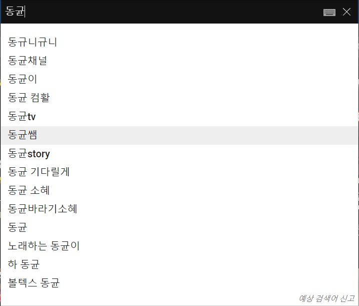
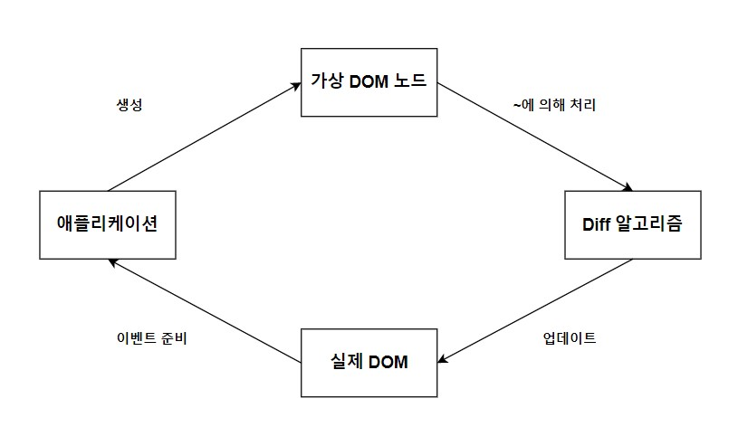

# diff 알고리즘

---



내가 겪었던 문제 상황이다. 조금 더 자세하게 설명하자면 searchbox에 2글자가 입력되면 해당 키워드를 포함하는 리스트를 api로 받아와 아래에 제안 박스를 렌더했어야 했다.

처음 시도했던 아이디어는 이러했다.

1. 인풋 박스에 입력이 2글자인지 확인한다.
2. 2글자 이상이라면 api 요청을 통해 리스트를 받아온다.
3. 제안 박스를 렌더한다.

사실 당연한 과정처럼 보이고, 문제가 없을 것 같다는 생각이 들 수 있다. 하지만, 내가 가져다 쓴 component 클래스 코드를 확인한다면 해당 부분이 어떠한 문제를 일으키는지 알 수 있다. (component 클래스는 [황준일 개발자님의 블로그](https://junilhwang.github.io/TIL/Javascript/Design/Vanilla-JS-Component/#_3-component-core-%E1%84%87%E1%85%A7%E1%86%AB%E1%84%80%E1%85%A7%E1%86%BC)의 코드를 거의 그대로 따라했다.)

```javascript
export default class Component {
  constructor($target, $props = '') {
	// ...
    this.$state = {};
    // ...
  }

  setState(newState) {
    this.$state = { ...this.$state, ...newState };
    this.render();
  }
  
  // ...
}

class Searchbox extends Component {
    ...
}
```

Component를 상속받은 Searchbox 컴포넌트의 상태값에는 키워드가 2글자가 되면 받아오는 리스트가 있었다.

상태값을 염두해보고 다시 실행의 흐름을 파악해본다.

1. 인풋 박스에 사용자가 입력한다.
2. 두 글자 이상이면, api를 통해 해당 키워드를 포함하는 리스트를 받아온다.
3. 해당 리스트를 `setState` 함수를 이용해 저장한다.
4. `setState` 함수는 리스트를 저장하고 화면을 리렌더한다.
5. 제안 박스가 렌더되었다가 바로 사라진다. 인풋 박스에 사용자가 작성한 키워드도 없다.

### 왜 이러한 일이 발생했을까?

이는 `this.render()`를 통한 렌더가 Searchbox 전체에 이루어졌기 때문이다. 제안 박스만 리렌더된 것이 아니라, 키워드를 입력하는 인풋 박스도 리렌더되면서 사용자의 입력이 모두 사라졌고 이 때문에 아래 제안 박스도 생기자마자 사라진 것이다.

이를 해결하는 방법은 다양할 것이다. 나는 인풋 박스와 제안 박스를 각각의 컴포넌트로 분리하고 2글자가 입력되어서 발생하는 리렌더의 경우에는 제안 박스 컴포넌트만 리렌더되도록 강제하였다.

### 왜 이렇게 생각했을까?

해당 문제를 해결하는 방법은 다양하겠지만, 제일 중요한 것은 나는 왜 처음에 해당 설계가 문제 없을 것이라고 생각했을까이다. 이에 대한 답은 

"나는 리액트의 useState와 class 컴포넌트의 setState를 동일하게 생각했기 때문이다." 

리액트가 제공하는 다양한 편리함에 빠져 class 컴포넌트도 알아서 편리함을 제공해줄 것이라고 믿었다. 하지만, 리액트가 가진 편리함 속에는 엄청난 고민들과 생각이 담겨 있으며, 그 중 하나인 diff 알고리즘을 설명한다.

---

 

diff 알고리즘을 사용하는 기본적인 흐름이다. 

1. 애플리케이션은 가상 DOM 트리를 만든다.
2. Diff 알고리즘은 실제 DOM 트리와 가상 DOM 트리에서 차이가 존재하는 노드들을 확인한다.
3. 차이가 존재하는 노드들만 실제 DOM 트리에 반영한다.
4. 실제 DOM 트리가 바뀌면서 애플리케이션에서도 해당 부분들만이 반영된다.

```html
<body>
    <div class="main" role="main">...</div>
</body>
```

이런 모양의 html이 있다고 가정할 떄 diff 알고리즘을 사용하는 메인 컨트롤러는 다음과 같다.

```javascript
const render = () => {
    window.requestAnimationFrame(() => {
        const parent = document.body;    // 부모
        const main = document.querySelector('.main');    // 실제 DOM
        const newMain = ~~~;    // 가상 DOM (가상 DOM을 만드는 코드는 따로 작성할 예정)
        applyDiff(parent, main, newMain);
    })
}
```

실제 diff 알고리즘 구현은 다음과 같다. (실제 DOM에 존재하는 노드 => 실제 노드, 가상 DOM에 존재하는 노드 => 가상 노드)

```javascript
const applyDiff = (parentNode, realNode, virtualNode) => {
    
    // 실제 노드는 있는데 가상 노드가 없다면 실제 노드 또한 사라졌음을 의미
    if (realNode && !virtualNode) {
        realNode.remove();
        return;
    }
    
    // 실제 노드는 없는데 가상 노드가 있다면 가상 노드가 실제가 돼야 함
    if (!realNode && virtualNode) {
        parentNode.appendChild(virtualNode);
        return;
    }
    	
    // 둘 다 존재하면서 차이가 존재한다면, 실제 노드를 가상 노드로 대체해야함
    if (isNodeChanged(virtualNode, realNode)) {
        realNode.replaceWith(virtualNode);
        return;
    }
    
    const realChildren = Array.from(realNode.children);
    const virtualChildren = Array.from(virtualNode.children);
    
    const max = Math.max(realChildren.length, virtualChildren.length);
    
    for (let i = 0; i < max; i++) {
        applyDiff(realNode, realChildren[i], virtualChildren[i]);
    }
}
```

가상 DOM을 기반으로 수정된 부분만 실제 DOM을 수정시킬 수 있다. 

그렇다면, 실제 노드와 가상 노드의 차이가 발생했는지 파악하는 `isNodeChanged` 함수는 어떻게 구현할 수 있을까.

3가지 지점을 확인해서 이를 결정할 수 있다.

1. 속성의 수가 다르다.
2. 하나 이상의 속성이 변경됐다.
3. 노드에는 자식이 없으며, textContent가 다르다.

3번째에서 왜 자식이 없는 경우만 확인할까?

> textContent는 노드의 모든 자식들에 대한 문자열을 하나의 문자열로 대치하기 때문이다.
>
> ```html
> <div id="divA">
>     This is <span>some</span> text!
> </div>
> 
> <script>
> 	document.getElementById('divA').textContent;
>     // 'This is some text!'
>     
>     document.getElementById('divA').textContent = 'This is new text!';
>     // The HTML for divA is now:
>     // <div id="divA">This is new text!</div>
> </script>
> ```

```javascript
const isNodeChanged = (node1, node2) => {
    const n1Attributes = node1.attributes;
    const n2Attributes = node2.attributes;
    
    if (n1Attributes.length !== n2Attributes.length) return true;
    
    const differentAttritube = Array.from(n1Attributes).find(attribute => {
        const { name } = attribute;
        const attribute1 = node1.getAttribute(name);
        const attribute2 = node2.getAttribute(name);
        
        return attribute1 !== attribute2;
    })
    
    if (differentAttribute) return true;
    
    if (node1.children.length === 0 && node2.children.length === 0 && node1.textContent !== node2.textContent) return true;
    
    return false;
}
```

---

여기까지 이해했다면, 이제는 리액트에서 왜 리스트에 key값을 사용하는지 이해할 수 있다. (아래의 모든 예제들은 리액트 공식 문서에 존재하는 것들을 가져왔습니다.)

```html
// 실제 DOM
<ul>
  <li>first</li>
  <li>second</li>
</ul>

// 가상 DOM
<ul>
  <li>first</li>
  <li>second</li>
  <li>third</li>
</ul>
```

위의 diff 알고리즘을 해당 경우에 적용해본다면 다음과 같은 흐름이 될 것이다.

1. 실제 DOM의 root와 가상 DOM의 root를 비교한다. 달라진 것이 없으므로 그대로 간다.
2. 실제 DOM의 자식들과 가상 DOM의 자식들을 꺼내어 배열로 만든다. 두 배열 중 더 큰 인덱스 값을 max로 잡고 0부터 max까지 순회를 시작한다.
3. 실제 DOM의 첫번째 자식인 `<li>first</li>`, 가상 DOM의 첫번째 자식인 `<li>first</li>`를 비교한다. 똑같기 때문에 넘어간다.
4. 실제 DOM의 두번째 자식인 `<li>second</li>`, 가상 DOM의 두번째 자식인 `<li>second</li>`를 비교한다. 똑같기 때문에 넘어간다.
5. 실제 DOM의 세번째 자식인 `undefined`, 가상 DOM의 세번째 자식인 `<li>third</li>`를 비교한다.  실제 노드는 없는데 가상 노드는 존재하기 때문에 가상 노드를 추가한다.

변경된 부분이 맨마지막이기 때문에 for loop를 통한 비교로 효율적인 처리가 가능하다.

두번째 예제이다.

```html
// 실제 DOM
<ul>
  <li>Duke</li>
  <li>Villanova</li>
</ul>

// 가상 DOM
<ul>
  <li>Connecticut</li>
  <li>Duke</li>
  <li>Villanova</li>
</ul>
```

1. 실제 DOM의 root와 가상 DOM의 root를 비교한다. 달라진 것이 없으므로 그대로 간다.
2. 실제 DOM의 자식들과 가상 DOM의 자식들을 꺼내어 배열로 만든다. 두 배열 중 더 큰 인덱스 값을 max로 잡고 0부터 max까지 순회를 시작한다.
3. 실제 DOM의 첫번째 자식인 `<li>Duke</li>`와 가상 DOM의 첫번째 자식인 `<li>Connecticut</li>`의 textContent가 다르다. 때문에 실제 DOM의 첫번째 자식을 가상 DOM의 첫번째 자식으로 교체한다.
4.  두번째의 경우에도 다르다. 때문에 실제 DOM의 두번째 자식을 가상 DOM의 두번째 자식으로 교체한다.
5. 세번째 경우, 실제 DOM의 3번째 자식은 존재하지 않지만 가상 DOM의 3번째 자식은 존재한다. 때문에 가상 DOM의 3번째 자식을 실제 DOM에 추가한다.

대충봐도 엄청나게 비효율적임을 알 수 있다. 가상 DOM의 첫번째 자식만 실제 DOM의 맨 앞에 추가하면 되는 작업임에도 불구하고 단순한 for loop는 3번의 교체 작업을 수행한다.

리액트에서는 이러한 비효율적인 과정을 없애기 위해 key를 사용한다. 과정은 다음과 같다.

---

이 과정은 아직 찾지 못했다. 대부분의 블로그에서는 단순히 key를 넣는 것이 더 효율적이다라고 설명할 뿐 리액트에서 어떻게 key를 처리해서 빨라지는 지에 대한 이야기가 없다. 지금 추측하기로는 이 방법이 아닐까 싶다.

1. 속성값의 이름 중 key가 있는 지 확인하고 그렇다면 다음 작업을 수행한다.
2. 변경되는 주체는 가상 DOM이다. 때문에 가상 DOM을 순회한다. 
3. 가상 DOM의 노드가 가지는 key를 실제 DOM의 노드 중에서 가지고 있는지 확인한다.
4. 그러한 노드가 없다면 그대로 실제 DOM에 추가, 그러한 노드가 있다면 위의 `isNodeChanged` 함수를 통해 변경된 지점이 있는지 파악. 변경되었다면 교체, 그렇지 않다면 그대로 간다.

확실하지 않기 때문에 조금 더 찾아보고 이 부분을 추가하겠다.

---

### 참고문헌

프레임워크 없는 프론트엔드 개발

https://ko.reactjs.org/docs/reconciliation.html

https://junilhwang.github.io/TIL/Javascript/Design/Vanilla-JS-Component/#_3-component-core-%E1%84%87%E1%85%A7%E1%86%AB%E1%84%80%E1%85%A7%E1%86%BC

https://developer-talk.tistory.com/102