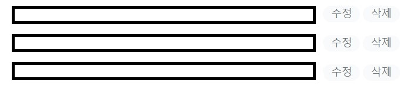

# ✈유용한 메서드 정리

---

### Element.remove()

> https://developer.mozilla.org/en-US/docs/Web/API/Element/remove

DOM 트리에서 요소를 삭제할 때 사용하는 메서드

---

### Element.closest()

> https://developer.mozilla.org/ko/docs/Web/API/Element/closest



```html
<ul>
    <li>
    	<input />
        <button>수정</button>
        <button>삭제</button>
    </li>
	<li>
    	<input />
        <button>수정</button>
        <button>삭제</button>
    </li>
    <li>
    	<input />
        <button>수정</button>
        <button>삭제</button>
    </li>
</ul>
```

수정 혹은 삭제 버튼을 클릭하는 경우 해당 행의 요소들에 대한 변경이 필요하다. 어떠한 행에서 이벤트가 발생했는지 어떻게 파악할 수 있을까. 

이때 사용할 수 있는 메서드가 `closest()`이다. 자신에서 시작하여 부모 요소들을 탐색하여 조건에 맞으면서 가장 가까이에 존재하는 element를 가져온다. `closet()`의 인자는 css 선택자가 들어간다.

예를 들어 위의 경우 삭제 버튼을 구현한다면 다음과 같은 코드를 작성할 수 있다.

```javascript
// 이벤트가 발생한 지점에서 가장 가까운 li 요소 삭제
const removeElement = (e) => {
	e.target.closest("li").remove();
};
```

---

### Element.classList

> https://developer.mozilla.org/ko/docs/Web/API/Element/classList

---

### window.requestAnimationFrame()

> https://developer.mozilla.org/ko/docs/Web/API/Window/requestAnimationFrame