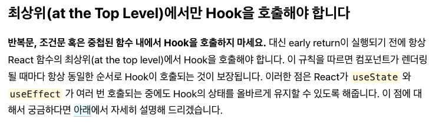

# 바닐라로 useState 구현하기

---

### 클로저에 대한 간단한 설명

*자바스크립트 엔진은 함수를 어디서 호출했는지가 아니라 함수를 어디에 정의했는지에 따라 상위 스코프를 결정한다. 이를 렉시컬 스코프라 한다.*

모던 자바스크립트 Deep Dive에서는 클로저를 이 한문장으로 정의한다. 조금 더 쉽게 표현하자면 모든 함수는 자신의 외부 상태에 대한 자신만의 스크린샷을 하나 가지고 있다고 말할 수 있다. 함수는 이 스크린샷을 참조 혹은 수정할 수 있다.

---

### 클로저 예제

그렇다면 왜 `useState`에서 클로저의 개념이 필요할까?

클로저는 함수 자신만이 가진 스크린샷을 참조 혹은 수정할 수 있기 때문이다. **즉, 함수는 클로저를 통해 `private value`를 만들어 사용할 수 있다.** 예제를 통해 클로저의 특징을 이해해본다.

값이 1씩 증가하는 변수 foo가 있다.

```javascript
let foo = 1;
function add() {
  foo = foo + 1;
  return foo;
}

console.log(add());  // 2
console.log(add());  // 3
console.log(add());  // 4
console.log(add());  // 5
console.log(add());  // 6
```

우리가 의도한대로 동작하나, `foo`가 전역 스코프에 있기 때문에 중간에 값이 조작될 수 있다는 문제점이 존재한다.

```javascript
function add() {
  let foo = 1;
  foo = foo + 1;
  return foo;
}

console.log(add());  // 2
console.log(add());  // 2
console.log(add());  // 2
console.log(add());  // 2
console.log(add());  // 2
```

`foo`가 전역 스코프에 존재하지 않지만 항상 2를 반환하게 된다. 이는 우리의 의도와 벗어난다.

```javascript
function getAdd() {
  let foo = 1;
  return function() {
    foo = foo + 1;
    return foo;
  }
}

const add = getAdd();
console.log(add());  // 2
console.log(add());  // 3
console.log(add());  // 4
console.log(add());  // 5
console.log(add());  // 6
```

우리의 의도와 맞으면서도 `foo`는 전역 스코프에 존재하지 않는다. 이것이 클로저를 활용한 예제이다. `getAdd()` 함수에서 반환되는 함수는 자신만의 스크린샷을 가지게 되고 이곳에는 `foo = 1`에 대한 정보가 기록된다. 이 함수는 `add`라는 변수에 할당되고 이후에 `add` 함수가 호출될 때마다 스크린샷에서 `foo`에 대한 정보를 가져오게 된다.

```javascript
const add = (function() {
    let foo = 1;
    return function() {
        foo = foo + 1;
        return foo;
    }
})();

console.log(add());  // 2
console.log(add());  // 3
console.log(add());  // 4
console.log(add());  // 5
console.log(add());  // 6
```

즉시실행함수를 이용하여 깔끔하게 리팩터링도 가능하다.

---

### useState

```react
import React, { useState } from 'react';

function Example() {
  // 새로운 state 변수를 선언하고, count라 부르겠습니다.
  const [count, setCount] = useState(0);

  return (
    <div>
      <p>You clicked {count} times</p>
      <button onClick={() => setCount(count + 1)}>
        Click me
      </button>
    </div>
  );
}
```

리액트에서 사용하는 `useState`의 모양이다. 이를 바탕으로 우리만의 `useState`를 구현해본다.

```javascript
function useState(initVal) {
    let _val = initVal;
    const state = _val;
    const setState = newVal => {
        _val = newVal;
    };
    return [state, setState];
}

const [count, setCount] = useState(1);
console.log(count)  // 1
setCount(2);
console.log(count)  // 1
```

리액트에서 제공하는 `useState`와 모양은 유사하다. 하지만 `setCount` 함수가 동작하지 않는 것을 확인 할 수 있다. 엄밀히 말하면 `setCount` 함수는 동작했지만 이미 할당된 `count`의 값이 변하지 않은 것이다.

```javascript
function useState(initVal) {
    let _val = initVal;
    const state = () => _val;
    const setState = newVal => {
        _val = newVal;
    };
    return [state, setState];
}

const [count, setCount] = useState(1);
console.log(count());  // 1
setCount(2);
console.log(count());  // 2
```

`state`를 단순한 변수가 아닌 함수로 만들어 클로저를 이용한다. `state` 함수는 `_val` 값이 포함되어 있는 스크린샷을 가지고 있기 때문에 이와 같은 결과가 나오게 된다. 

분명 결과만 봤을 때 우리의 의도대로 값이 출력되었지만 실제 리액트에서 `count`는 함수가 아닌 변수여야 한다.

```javascript
const React = (function() {
    let _val;
    function useState(initVal) {
        const state = _val || initVal;
        const setState = newVal => {
            _val = newVal;
        };
        return [state, setState];
    }
    function render(Component) {
        const C = Component();
        C.render();
        return C;
    }
    return { useState, render };
})();

function Component() {
    const [count, setCount] = React.useState(1);
    return {
        // render와 click이 함수 형태여서 값을 기억하고 있는건가...
        render: () => console.log(count),
        click: () => setCount(count + 1)
    };
}

var App = React.render(Component);  // 1
App.click();
var App = React.render(Component);  // 2
App.click();
var App = React.render(Component);  // 3
App.click();
var App = React.render(Component);  // 4
App.click();
var App = React.render(Component);  // 5
```

`count`를 함수가 아닌 변수로 만들기 위해 다음과 같이 하나의 `Component`를 구성하여 해결할 수 있다.

```javascript
const React = (function() {
    let hooks = [];
    let idx = 0;
    function useState(initVal) {
        const state = hooks[idx] || initVal;
        const _idx = idx;
        const setState = newVal => {
            hooks[_idx] = newVal;
        };
        idx++;
        return [state, setState];
    }
    function render(Component) {
        idx = 0;
        const C = Component();
        C.render();
        return C;
    }
    return { useState, render };
})();

function Component() {
    const [count, setCount] = React.useState(1);
    const [text, setText] = React.useState("apple");
    return {
        render: () => console.log({ count, text }),
        click: () => setCount(count + 1),
        type: word => setText(word)
    };
}

var App = React.render(Component);
App.click();
var App = React.render(Component);
App.type("pear");
```

다음과 같이 `idx`를 이용하여 여러개의 `state`들을 동시에 개별로 관리할 수도 있다.



`idx`를 이해했다면 왜 `useState`가 반복문, 조건문, 중첩된 함수 내에서 호출될 수 없는지 알 수 있다. `state` 값들은 `idx` 를 기준으로 분류되고 관리된다. 만약 반복문, 조건문, 중첩된 함수 내에서 `useState`가 호출된다면 특정한 경우 실행되지 못한채 끝나게 되고, 이는 `state` 값들의 순서를 뒤바꾸게 된다.

```javascript
// Don't call Hooks inside loops, conditions, or nested functions
// 이런 식으로 코드를 작성해버리면 text의 인덱스가 0이 될 수도 1이 될 수도 있게 된다. 이 때문에 state를 순서대로 유지하기가 어려워진다.
function Component() {
    if (Math.random() > 0.4) {
        const [count, setCount] = React.useState(1);
    }
    const [text, setText] = React.useState("apple");
    return {
        render: () => console.log({ count, text }),
        click: () => setCount(count + 1),
        type: word => setText(word)
    };
}
```

---

### 참고문헌

https://www.youtube.com/watch?v=KJP1E-Y-xyo

### 참고해야 하는 문헌

https://hewonjeong.github.io/deep-dive-how-do-react-hooks-really-work-ko/

